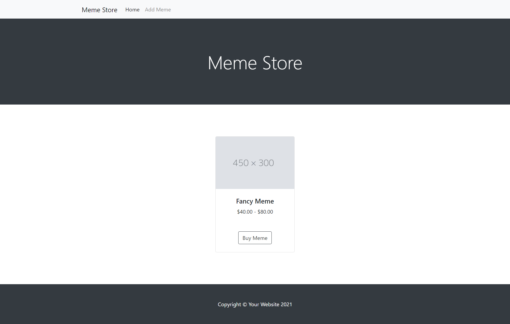

# Express.js Meme Website
So you know that we love memes! In this assignment, we will create a website for memes using Express.js and we will specifically utilize the EJS view template engine to create web pages. The objectives of this assignment are:
1. Understanding how to use EJS with Express
2. Practicing GET and POST requests
3. Understanding the difference between static and dynamic pages

## What is EJS?
EJS, short for Embedded JavaScript templating, is a simple templating language that lets you generate HTML markup with plain JavaScript. It allows you to generate full-blown HTML pages which certainly enables a "proper frontend".

EJS is a tool for generating web pages that can include dynamic data and can share templated pieces with other web pages (such as common headers/footers). It is not a frontend framework. While EJS can be used by client-side JavaScript to generate HTML on the client-side, it is more typically used on the backend to generate web pages in response to some URL request. EJS is not a client-side framework like Angular or React and does not dictate what client-side framework you do or don't use (if any).

Template engines like EJS are most useful for the concept of server-side rendering (SSR) which is a popular technique for rendering a normally client-side only single page app (SPA) on the server and then sending a fully rendered page to the client. The client’s JavaScript bundle can then take over and the SPA can operate as normal.

## Setup
1. Open your terminal and navigate to your dedicated assignments folder.
2. Then clone this assignment repo on your local machine.
3. Now open the assignment folder on VSCode.

Looking at our `package.json` file, we will see that there are some packages already included here. All we have to do is run `npm install` to install the listed packages.

The packages that we will use are as follows: Express.JS, EJS, and Nodemon.

We are already familiar with what Express and EJS do. As for the third package: Nodemon is a utility that will monitor for any changes in your source code and automatically restart your server. This means that you don't need to restart your server manually after every little code change. If you check the start script in `package.json`, you will see that it is `nodemon app.js` instead of `node app.js`. That's all you need to get Nodemon running!

**Please note**: Since we have already listed the packages for this repo, a simple `npm install` is all you need to get started. If you were to add an individual package yourself, for example ejs, then you would run `npm install ejs`.

## Initializing our Express app
In the current directory, create a new file and name it `app.js`. And then let's start with writing these lines of code.
```js
const express = require("express")
const bodyParser = require("body-parser")
const app = express()
```
Here we are importing our Express package, and then we initialize a variable called app as an Express application. We use the body-parser package which is a Node.js body parsing [middleware](https://expressjs.com/en/guide/writing-middleware.html). It is responsible for parsing the incoming request bodies before passing forward to your handlers.

Now we have to configure our app to use the EJS view engine, body-parser and json parser by adding these lines.
```js
app.use(bodyParser.urlencoded({ extended: false }))
app.use(express.json())
app.set("view engine", "ejs")
app.set("views", "views")
```
The first three lines are self-explanatory, we are choosing the default body-parser and json parser and setting our view engine. The extended option allows to choose between parsing the URL-encoded data with the querystring library (when false) or the qs library (when true).

As for the fourth line, `app.set("view", "views")` : This will be the directory where the template files are located. We are setting it to a folder called `views` in our project directory.

Now let's create our variable that will store our memes, starting with two memes.
```js
const memes = [
    {
        name: "Memes that make us smile",
        imgURL: "https://exse.eyewated.com/pict/c38cc4d7ef9a30de-1024x683.jpg",
        price: "$20.00 - $30.00"
    },
    {
        name: "Programmer memes",
        imgURL: "https://aprogrammerlife.com/images/pictuers/programmers_looking_at_programming_memes.jpg",
        price: "$10.00"
    }
]
```

Add this lines to listen for incoming requests on port 3000:
```js
app.listen(3000, () => console.log("Server running on port 3000"))
```

Finally add this line to export the app variable outside this file.
```js
module.exports = app
```

## Creating our first page
After we got our Express app setup and initialized, it's time to write the requests that our app should handle and assign which pages it should render.

We have already created the `views` directory for you with an ejs file called `index.ejs`. We will use this template to render the home page of our website where we will display all our memes. Take a quick look at it.

If you are familiar with HTML, it will not take you long to understand the components we will be displaying. Basically, we have the following components:
1. A navigation bar with 2 navigation items: "Home" and "Add Meme"
2. A section displaying the name of our site as "Meme Store".
3. A component which displays the details of our meme. For now it has some dummy data to display.
4. And a simple footer for the site.

We will be using the `render()` function. To use `views`, we use the file path relative to `views` folder and each view name becomes the file path minus the root directory and the file extension. For example, if you had the following file structure:
```
/views/
    index.ejs
    news/
        index.ejs
        article1.ejs
        article2.ejs
```

You would render the views as follows:
```js
res.render("index")  
res.render("news/index")  
res.render("news/article1")  
res.render("news/article2")
```

So let us render this page as a response to the GET request for root path `/` of our application. Add these lines in `app.js` just before the last line where we called `listen()`.
```js
app.get("/", (req, res) => {
    res.render("index")
})
```

Let’s test this out! Start the app by running `npm start`. Now visit `http://localhost:3000` on the browser, you should be able to see this:



## Practice Time
Now that you have the starter code for this assignment, it's time to do some Googling and put together our meme website. You can begin with exploring the documentation on the [EJS website](https://ejs.co/).

### Requirements
1. Display the list of memes on the home page by passing memes data to EJS.
2. Create a GET request `/add-meme` that renders a page including a form to add a new meme.
3. Create the form needed to add a new meme using an EJS template.
4. Create and handle a POST request `/memes` when the form is submitted to save the new meme in our memes list.

#### Part 1: Display list of memes
- First, you will have to modify the render call to `res.render("index", {memes})`. This will ensure that the EJS template has access to our memes variable.
- Now begin with displaying the data of our first meme `memes[0]`. Check the EJS documentation or do a Google search for inserting dynamic data in EJS, and replace all the dummy data with properties of `memes[0]`.
- Once you're able to display the first meme, look for displaying a list view with looping in EJS. Iterate over the `memes` array and display each meme in the view.

#### Part 2: GET `/add-meme`
- First, you will need to create a new EJS file in the views folder and name it `add-meme.ejs`. You can leave it empty for now.
- Then in `app.js`, create a GET request which listens for the `/add-meme` endpoint and it should respond by rendering the EJS file you just created.

#### Part 3: Creating the form
Okay so far so good, we now have another page for our form, now it's time to build it.
- The form should have 3 fields for the new meme: name, price, and image URL.
- After the user submits the form a POST request should be sent to the endpoint `/memes` with the form data.
- Focus on the functionality of the form, and don't worry about styling this page for now.

#### Part 4: POST `/memes`
Now it's time to handle the POST request we will receive from the form.
- Create a POST request for `/memes` in `app.js`.
- Using the request body, push a new Meme to our `memes` array.
- As a response, redirect the user to our home page `/`.
- You should be able to see the new meme on the home page.

#### Bonus
These are completely optional, but you can try out for additional practice.
- Try to display the header and footer on the form page using reusable templates.
- Try to use bootstrap class names similar to the home page to style your form page.

### Submission
Run `npm test` to test your code. If it shows all tests have passed then you're good to go.

Since this is a group assignment and you will be sharing the assignment repo with your group member, you can perform intermediate commits and pushes as required to share your code within your group.

Once you're ready to submit the assignment, follow these steps on your terminal:
1. Stage your changes to be committed: `git add .`
2. Commit your final changes: `git commit -m "solve assignment"`
3. Push your commit to the main branch of your assignment repo: `git push origin main`

After your changes are pushed, return to this assignment on Canvas for the final step of submission.

## Conclusion
Now you know how to create an Express application and handle GET and POST requests. You have also explored server-side rendering and creating a "frontend" using EJS templating on the backend.

There are many more templating engines that can be used in the Express framework, you can explore these [here](https://expressjs.com/en/resources/template-engines.html). One other alternative to EJS is [Pug](https://pugjs.org/api/getting-started.html). For those of you familiar with React, you can actually also render React components from Express.

In the next assignment, we will look at building a REST API using Express.

---
## References
- https://ncoughlin.com/posts/express-ejs-render-page-dynamic-content/#adding-variables-to-ej
- https://www.digitalocean.com/community/tutorials/how-to-use-ejs-to-template-your-node-application
- https://www.geeksforgeeks.org/node-js-server-side-rendering-ssr-using-ejs/